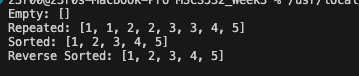
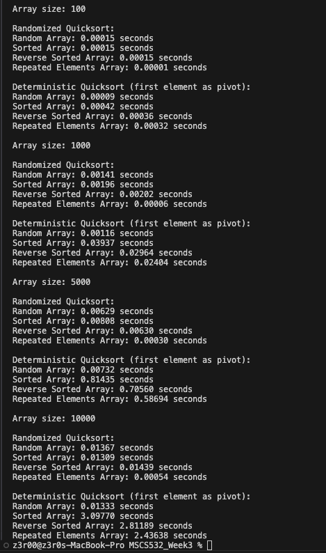
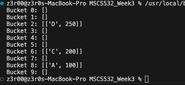
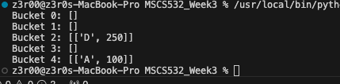

Part 1: Randomized Quicksort Analysis

File Name: Random-QS.py
Findings: The initial code was throwing "RecursionError: maximum recursion depth exceeded"
which was solved by setting the recursive
sys.setrecursionlimit(1500)
Output: To get the output of the code, simply run the code in VSC. Below is the screenshot of the output

Part 2: Hashing with Chaining

File Name: HashChain.py
Findings: No major error while running this part of code.
Output: To get the output of the code, simply run the code in VSC. Below is the screenshot of the output
Output when the slot have exceeded 75% ( initial capacity changed from 5 to 10):

Output when the slot did not exceed 75%. (Capacity = 5) To get this result,
please comment out one of the insert data (hash_table.insert('C', 200)):

Please review doc.md for further analysis document.
